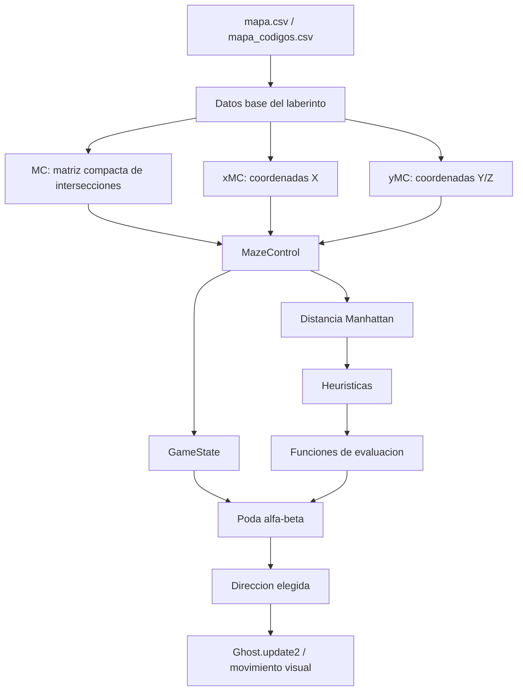
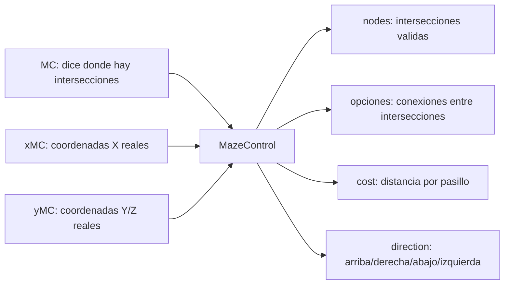
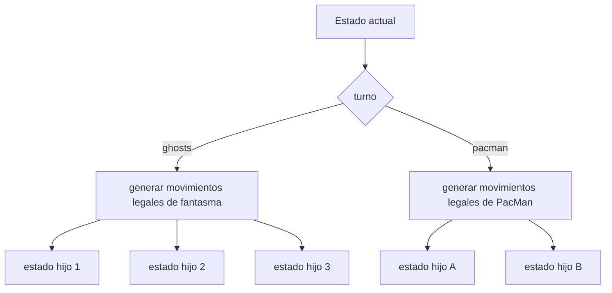
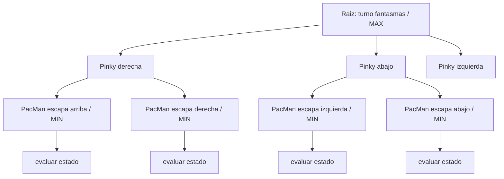
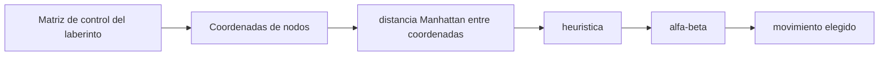
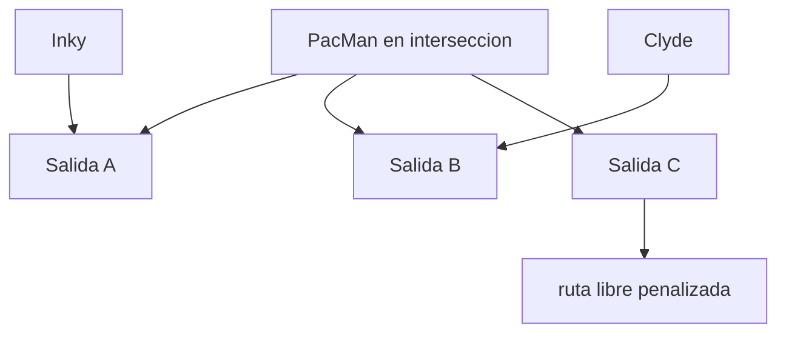
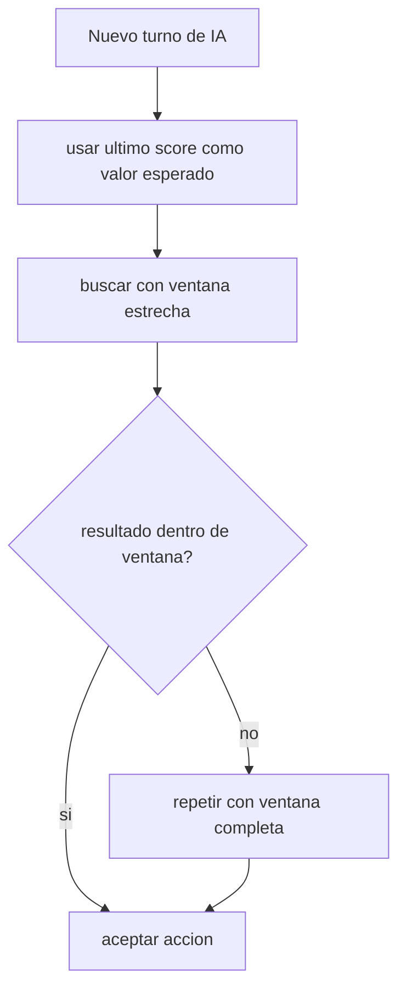
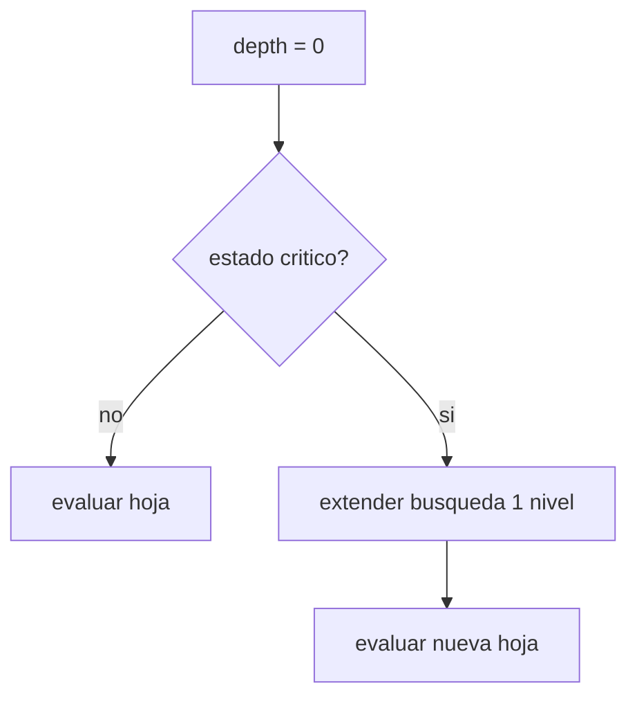
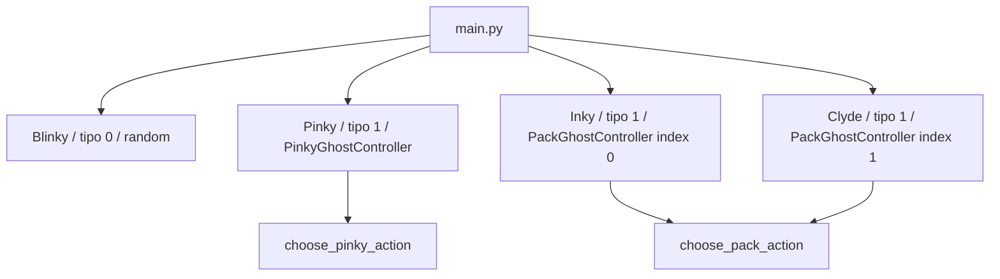

# Analisis De Alpha-Beta, Distancia Manhattan, Matriz De Control Y Preguntas

## Objetivo Del Documento

Este documento explica como se esta usando la inteligencia artificial del proyecto PacMan:

- como usamos poda alfa-beta;
- como usamos distancia Manhattan sin pathfinding;
- como se implemento la busqueda;
- por que usamos `MazeControl` para consultar directamente `MC`, `xMC` y `yMC`;
- que heuristicas se usan;
- cuales son las funciones de evaluacion;
- que mejoras se agregaron a alfa-beta y por que se eligieron;
- que preguntas conviene hacer al profesor para validar detalles de criterio.

La idea principal del proyecto es que los fantasmas no decidan en cada pixel. Deciden solo cuando llegan a una interseccion del laberinto. Eso reduce mucho el problema y coincide con la forma en que normalmente se mueve PacMan: en un pasillo se sigue avanzando, y en una interseccion se toma una decision.

---

## Vista General Del Flujo



Resumen:

1. Los CSV y matrices del proyecto ya tienen el mapa.
2. `MazeControl` consulta `MC` para obtener intersecciones y conexiones.
3. `GameState` representa una foto logica del juego.
4. Alfa-beta simula movimientos futuros.
5. La distancia Manhattan calcula cercania heuristica entre nodos, sin buscar caminos.
6. Las heuristicas convierten cada estado en un numero.
7. El fantasma toma la direccion con mejor resultado.

---

## Por Que Usar MazeControl Sobre MC

El proyecto ya tenia la informacion importante del laberinto:

```text
MC
xMC
yMC
mapa.csv
mapa_codigos.csv
```

Esa informacion ya es suficiente. La razon de `MazeControl` no es crear otra representacion complicada, sino centralizar consultas repetidas sobre `MC`:

- desde esta interseccion, a que intersecciones puedo llegar?
- que direccion debo tomar para llegar a cada vecino?
- cuanto cuesta llegar al siguiente nodo?
- si simulo varios movimientos, cual seria el siguiente estado?
- que distancia heuristica hay entre un fantasma y PacMan?

Por eso se agrego `IA/maze_control.py`. No reemplaza a `MC`, `xMC` ni `yMC`; los usa como fuente.



Diferencia clave:

```text
MC responde: "esta posicion es una interseccion de tipo 25".

MazeControl responde: "desde esta interseccion puedes ir a estos vecinos,
con estas direcciones y estos costos".
```

Eso hace que alfa-beta pueda trabajar sobre decisiones importantes y no sobre pixeles.

---

## Nodos, Opciones Y Direcciones

Cada nodo de la matriz de control es una interseccion real de `MC`. Se representa como:

```python
(row, col)
```

Cada conexion tiene:

```python
MoveOption(target, direction, cost)
```

Donde:

- `target` es el nodo destino;
- `direction` es la direccion que debe tomar el actor;
- `cost` es la distancia real entre intersecciones, medida con las coordenadas `xMC` y `yMC`.

Las direcciones respetan los codigos del proyecto:

```text
0 = arriba
1 = derecha
2 = abajo
3 = izquierda
```

Ejemplo conceptual:

```text
nodo A -- derecha / costo 71 --> nodo B
```

Eso significa que si el fantasma esta en `nodo A` y toma direccion `1`, llegara a `nodo B` recorriendo 71 unidades de distancia del mapa.

---

## Como Se Implemento La Busqueda

La busqueda se implemento por estados, no por pixeles.

El estado principal esta en `IA/game_state.py`:

```python
GameState(
    pacman=ActorState(...),
    ghosts=(ActorState(...), ...),
    turn="ghosts" o "pacman",
    tabu=(...)
)
```

Cada `ActorState` guarda:

```python
node
direction
```

Es decir, guarda en que interseccion esta el actor y hacia donde venia moviendose.

La generacion de hijos se hace con estas funciones:

```text
generate_pacman_children
generate_single_ghost_children
generate_joint_ghost_children
```

Estas funciones crean todos los estados futuros posibles desde una interseccion.



Reglas importantes:

- PacMan puede considerar sus salidas disponibles.
- Los fantasmas respetan la regla de no regresar por el camino por donde llegaron.
- Si un fantasma solo tiene el camino inverso disponible, se le permite tomarlo para no quedar bloqueado.
- El historial tabu se actualiza cuando se simulan movimientos de fantasmas.

---

## Como Usamos Poda Alfa-Beta

Alfa-beta se usa como una version optimizada de minimax.

La idea es:

```text
MAX intenta maximizar el score.
MIN intenta minimizar el score.
```

En este proyecto:

```text
Pinky:
MAX = Pinky
MIN = PacMan

Inky/Clyde:
MAX = Inky y Clyde como pareja
MIN = PacMan
```

Para Pinky, la accion de MAX es una sola direccion:

```python
best_action = 0, 1, 2 o 3
```

Para Inky y Clyde, la accion de MAX es conjunta:

```python
best_action = (direccion_inky, direccion_clyde)
```

Eso permite que los dos fantasmas colaborativos no decidan de forma aislada. El algoritmo evalua combinaciones de movimientos.



La poda alfa-beta evita revisar ramas que ya no pueden cambiar la decision final.

```text
alpha = mejor valor garantizado para MAX
beta  = mejor valor garantizado para MIN

si alpha >= beta:
    se corta la rama
```

Esto es importante porque el arbol crece rapido, especialmente con dos fantasmas colaborativos.

---

## Profundidades Actuales

Valores actuales:

```text
Pinky: depth = 4
Inky/Clyde: depth = 3
```

Interpretacion de Pinky con profundidad 4:

```text
1. Pinky mueve
2. PacMan responde
3. Pinky mueve
4. PacMan responde
```

Interpretacion de Inky/Clyde con profundidad 3:

```text
1. Inky y Clyde mueven juntos
2. PacMan responde
3. Inky y Clyde mueven juntos
```

La profundidad colaborativa es menor porque una decision de dos fantasmas genera combinaciones. Si Inky tiene 3 opciones y Clyde tiene 3 opciones, el turno conjunto puede generar 9 hijos.

---

## Como Usamos Distancia Manhattan

La version actual no usa busqueda de camino minimo.

Para evitar que el proyecto parezca resuelto por pathfinding, las heuristicas usan distancia Manhattan entre coordenadas de nodos.

```text
La distancia Manhattan mide cercania.
Alfa-beta decide.
```

La distancia Manhattan no calcula el camino mas corto por el laberinto. Solo calcula una estimacion con:

```text
abs(x1 - x2) + abs(y1 - y2)
```

Se eligio Manhattan como distancia por defecto porque el movimiento del juego es ortogonal:

```text
arriba
derecha
abajo
izquierda
```

Tambien existe una funcion de distancia euclidiana como alternativa, pero la configuracion actual usa Manhattan.



Ejemplo:

```text
Pinky simula varias opciones legales desde una interseccion.
Para cada opcion se estima que tan cerca queda de PacMan con Manhattan.
Alfa-beta compara esos estados junto con las demas heuristicas.
```

La pared no se resuelve con pathfinding. La pared se respeta porque los hijos de alfa-beta solo se generan desde movimientos legales de la matriz de control.

---

## Donde Aparece La Distancia En Las Heuristicas

La distancia heuristica se usa indirectamente por estas funciones:

```python
manhattan_distance(maze, origin, destination)
manhattan_distance(maze, origin, destination)
distance_to_pacman(maze, state, ghost_index)
pacman_exit_coverage(maze, state)
useful_separation_score(maze, state)
```

Todas esas funciones terminan usando las coordenadas del nodo:

```python
maze.node_to_pixel(node, include_world_offset=False)
```

Por eso, cuando alfa-beta evalua un estado, no ejecuta busqueda de caminos. Solo calcula una distancia geometrica entre intersecciones.

---

## Heuristicas De Pinky

Pinky es el fantasma rosa que usa alfa-beta individual.

La funcion principal es:

```python
evaluate_pinky_state(maze, state, ghost_index=0)
```

Componentes:

```text
1. distance_to_pacman
2. pacman_escape_routes
3. tabu_penalty
```

### 1. Distancia A PacMan

Funcion:

```python
distance_to_pacman(maze, state, ghost_index=0)
```

Sirve para saber que tan lejos esta Pinky de PacMan siguiendo los pasillos reales.

Se usa con signo negativo:

```text
menor distancia = mejor score
mayor distancia = peor score
```

### 2. Rutas De Escape De PacMan

Funcion:

```python
pacman_escape_routes(maze, state)
```

Cuenta cuantas salidas tiene PacMan desde su interseccion actual.

Se penaliza porque para el fantasma es peor que PacMan tenga muchas opciones.

```text
PacMan con 4 salidas = mas dificil de atrapar
PacMan con 1 salida = mas facil de presionar
```

### 3. Penalizacion Tabu

Funcion:

```python
tabu_penalty(state, ghost_index=0)
```

Sirve para reducir ciclos. No prohibe completamente regresar a un nodo reciente; lo penaliza en la evaluacion.

Esto se eligio porque prohibir demasiado puede dejar al fantasma sin una buena jugada en pasillos estrechos.

### Formula De Pinky

Formula conceptual:

```text
score =
  - 1.0  * distancia_a_PacMan
  - 12.0 * rutas_de_escape_de_PacMan
  - 25.0 * penalizacion_tabu
```

Si Pinky llega al mismo nodo que PacMan:

```text
score = 10000
```

Ese valor representa captura.

---

## Heuristicas De Inky Y Clyde

Inky y Clyde trabajan en conjunto para intentar encerrar a PacMan.

La funcion principal es:

```python
evaluate_pack_state(maze, state, ghost_indices=(0, 1))
```

Componentes:

```text
1. total_distance_to_pacman
2. minimum_distance_to_pacman
3. pacman_escape_routes
4. covered_exits
5. free_routes
6. useful_separation
7. exit_overlap_penalty
8. tabu_penalty
```

### Distancia Total

```text
total_distance_to_pacman = distancia_inky + distancia_clyde
```

Sirve para que la pareja completa se acerque a PacMan.

### Distancia Minima

```text
minimum_distance_to_pacman = distancia del fantasma mas cercano
```

Sirve para que al menos uno de los dos mantenga presion directa sobre PacMan.

### Rutas De Escape

```text
pacman_escape_routes = salidas disponibles desde la interseccion de PacMan
```

Si PacMan tiene muchas salidas, el estado es peor para los fantasmas.

### Salidas Cubiertas

```text
covered_exits = salidas de PacMan que estan cerca de Inky o Clyde
```

Este componente premia que los fantasmas cubran rutas alternativas.

### Rutas Libres

```text
free_routes = pacman_escape_routes - covered_exits
```

Este componente penaliza que queden salidas sin cubrir.

### Separacion Util

```text
useful_separation = 1 si estan separados de forma util
useful_separation = -1 si estan demasiado juntos
```

Sirve para evitar que ambos fantasmas se amontonen en el mismo pasillo.

### Penalizacion Por Cubrir La Misma Salida

```text
exit_overlap_penalty = 1 si ambos cubren la misma salida principal
```

Esto se penaliza porque desperdicia la colaboracion.

### Penalizacion Tabu

Se suma la penalizacion tabu de ambos fantasmas.

---

## Formula De Evaluacion Colaborativa

Formula conceptual:

```text
score =
  - 0.65 * distancia_total_a_PacMan
  - 0.35 * distancia_minima_a_PacMan
  - 10.0 * rutas_de_escape_de_PacMan
  + 55.0 * salidas_cubiertas
  - 35.0 * rutas_libres
  + 25.0 * separacion_util
  - 40.0 * penalizacion_por_misma_salida
  - 25.0 * penalizacion_tabu
```

Si cualquiera de los dos fantasmas alcanza el mismo nodo que PacMan:

```text
score = 10000
```

Diagrama de la idea colaborativa:



Un estado ideal no es necesariamente que ambos fantasmas esten pegados a PacMan. A veces es mejor que uno presione y el otro bloquee una salida.

---

## Funciones De Evaluacion

Las funciones de evaluacion principales son:

```python
evaluate_pinky_state(maze, state, ghost_index=0)
evaluate_pack_state(maze, state, ghost_indices=(0, 1))
```

Funciones auxiliares importantes:

```python
pinky_heuristic_components(maze, state, ghost_index=0)
pack_heuristic_components(maze, state, ghost_indices=(0, 1))
distance_to_pacman(maze, state, ghost_index=0)
pacman_escape_routes(maze, state)
pacman_exit_coverage(maze, state)
exit_overlap_penalty(maze, state)
useful_separation_score(maze, state)
tabu_penalty(state, ghost_index=0)
```

Estas funciones separan dos cosas:

```text
componentes heuristicos = mediciones explicables
funcion de evaluacion = combinacion ponderada de esas mediciones
```

Eso ayuda a justificar el diseno en el reporte.

---

## Mejoras Agregadas A Alfa-Beta

El documento del parcial pide usar poda alfa-beta e incluir estrategias de mejora vistas en clase. Se eligieron:

```text
1. Busqueda ambiciosa
2. Continuacion heuristica
```

Ademas, por indicacion del enunciado, se mantiene:

```text
Tabu con horizonte limitado
```

Tambien se usan optimizaciones complementarias:

```text
ordenamiento de movimientos
corte por estado terminal de captura
metricas de busqueda
```

---

## Mejora 1: Busqueda Ambiciosa

En el codigo se implementa como una busqueda con ventana alfa-beta estrecha.

Normalmente alfa-beta inicia con:

```python
alpha = -inf
beta = inf
```

Con busqueda ambiciosa se intenta primero:

```python
alpha = valor_esperado - ventana
beta = valor_esperado + ventana
```

En el proyecto:

```text
valor_esperado = ultimo valor calculado por el controlador
```

Valores actuales:

```text
Pinky: ventana = 80
Inky/Clyde: ventana = 120
```

Si el resultado cae dentro de la ventana, se acepta. Si queda fuera, se repite con ventana completa.



Por que se eligio:

- Es una mejora vista en busquedas de juegos.
- Aprovecha que de un frame a otro el estado no cambia de forma extrema.
- Puede reducir busqueda cuando el valor esperado es razonable.
- Si falla, no cambia la respuesta final porque se hace una re-busqueda completa.

---

## Mejora 2: Continuacion Heuristica

La continuacion heuristica ayuda a reducir el efecto horizonte.

Problema:

```text
Alfa-beta llega a depth = 0 y evalua.
Pero tal vez el estado justo en esa hoja es critico.
Si se detiene ahi, puede perder una captura o una escapatoria importante.
```

Solucion:

```text
Si la hoja parece critica, se expande 1 nivel adicional.
```

Valor actual:

```text
heuristic_continuation_depth = 1
```

Para Pinky, se continua si:

```text
distancia a PacMan <= 120
o PacMan tiene 3 o mas rutas de escape
```

Para Inky/Clyde, se continua si:

```text
distancia minima a PacMan <= 120
o PacMan tiene rutas libres
o Inky y Clyde estan cubriendo la misma salida
```



Por que se eligio:

- Es una mejora clasica para reducir efecto horizonte.
- Es facil de explicar con estados criticos del laberinto.
- No aumenta toda la profundidad, solo casos importantes.
- Permite mirar un poco mas alla cuando PacMan esta cerca de ser atrapado o cuando aun tiene salidas libres.

---

## Tabu Con Horizonte Limitado

El tabu se guarda en:

```python
GameState.tabu
```

Cada vez que se simula un movimiento de fantasma, se agrega el nodo nuevo al historial tabu:

```text
("ghost", ghost_index, node)
```

El horizonte actual es:

```text
tabu_horizon = 4
```

Eso significa que solo se recuerdan los ultimos nodos simulados. No es memoria infinita.

En este proyecto el tabu penaliza, no prohibe.

```text
penalizar = todavia puede elegir ese movimiento si es muy bueno
prohibir = nunca lo puede elegir, aunque sea necesario
```

Se eligio penalizacion porque el laberinto tiene pasillos donde a veces regresar o pasar por un nodo reciente puede ser inevitable.

---

## Ordenamiento De Movimientos

Tambien se usa:

```python
order_children(children, evaluate, maximizing)
```

Esto ordena primero los hijos que parecen mejores segun la evaluacion.

No cambia la logica de minimax, pero ayuda a que alfa-beta encuentre cortes antes.

```text
mejor orden de hijos = mas probabilidad de podar ramas
```

Esta mejora es complementaria. Las dos mejoras principales para reportar son busqueda ambiciosa y continuacion heuristica.

---

## Como Se Integran Los Fantasmas

Estado actual:

```text
ghosts[0] = Blinky rojo, movimiento aleatorio
ghosts[1] = Pinky rosa, alfa-beta individual
ghosts[2] = Inky azul/cian, alfa-beta colaborativo
ghosts[3] = Clyde naranja, alfa-beta colaborativo
```

Diagrama:



`PackGhostController` toma una foto de las posiciones de Inky, Clyde y PacMan. Luego calcula una decision conjunta una sola vez y entrega a cada fantasma su direccion correspondiente.

---

## Resumen De Responsabilidades Por Archivo

```text
IA/maze_control.py
  Convierte MC/xMC/yMC en matriz de control.
  Calcula vecinos, direcciones, costos directos y conversion nodo/pixel.

IA/game_state.py
  Define ActorState y GameState.
  Genera hijos para PacMan, un fantasma o dos fantasmas.
  Aplica regla de no reversa y tabu con horizonte limitado.

IA/heuristics.py
  Define componentes heuristicos.
  Define evaluate_pinky_state y evaluate_pack_state.

IA/alpha_beta.py
  Implementa poda alfa-beta.
  Implementa busqueda ambiciosa.
  Implementa continuacion heuristica.
  Elige acciones para Pinky e Inky/Clyde.

IA/ghost_controller.py
  Conecta el juego visual con los estados logicos de IA.
  Guarda ultimo valor para busqueda ambiciosa.
  Guarda metricas y componentes para depuracion.

Ghost.py
  Mueve visualmente al fantasma.
  Pide direccion al controlador cuando llega a interseccion.

main.py
  Crea la matriz de control, controladores y fantasmas.
  Configura colores/tipos.
  Imprime logs de IA cuando estan activos.
```

---

## Por Que Esto Cumple La Idea Del Proyecto

El enunciado pide:

- un fantasma aleatorio que respete reglas generales;
- un fantasma con alfa-beta y una funcion de evaluacion con al menos dos componentes heuristicos;
- fantasmas colaborativos que intenten cazar a PacMan;
- mejoras a alfa-beta vistas en clase;
- tabu con horizonte limitado.

Relacion con la implementacion:

```text
Blinky:
  movimiento aleatorio, sin regresar por donde llego cuando hay alternativas.

Pinky:
  alfa-beta individual.
  heuristicas: distancia Manhattan, rutas de escape, tabu.

Inky/Clyde:
  alfa-beta colaborativo con acciones conjuntas.
  heuristicas: distancia, cobertura de salidas, rutas libres, separacion, overlap, tabu.

Mejoras:
  busqueda ambiciosa.
  continuacion heuristica.
  tabu con horizonte limitado.
```

---

## Preguntas Para Hacer Al Profesor

Estas preguntas sirven para validar criterios de evaluacion. Algunas ya estan resueltas en el codigo, pero conviene preguntarlas porque afectan como se debe justificar el proyecto.

### 1. Sobre No Usar Pathfinding Dentro De Alfa-Beta

Contexto:

El profesor aclaro que no debe usarse camino minimo porque entonces la persecucion pareceria pathfinding y no busqueda adversarial. Por eso la evaluacion usa distancia Manhattan.

Pregunta:

```text
Profesor, para la heuristica de cercania en alfa-beta, prefiere que usemos
distancia Manhattan por el tipo de movimiento del juego, o distancia Manhattan?
```

Por que importa:

Sirve para dejar claro que no estamos usando pathfinding y que la distancia solo es una estimacion heuristica.

### 2. Sobre La Captura Por Nodo O Por Pixel

Contexto:

La IA trabaja en nodos de la matriz de control. Visualmente el juego se mueve por pixeles. Puede haber diferencia entre "mismo nodo logico" y "colision visual exacta".

Pregunta:

```text
Para la evaluacion de alfa-beta, la captura debe considerarse cuando el fantasma
y PacMan llegan al mismo nodo/interseccion, o cuando hay colision visual por pixeles?
```

Por que importa:

Define si `CAPTURE_SCORE = 10000` debe activarse por nodo logico o por distancia visual.

### 3. Sobre Tabu: Penalizar O Prohibir

Contexto:

Implementamos tabu como penalizacion, no como prohibicion absoluta.

Pregunta:

```text
Cuando el enunciado pide Tabu con horizonte limitado, espera que los movimientos
tabu esten prohibidos completamente, o es aceptable penalizarlos en la funcion
de evaluacion?
```

Por que importa:

Penalizar es mas flexible en pasillos estrechos, pero prohibir es una interpretacion mas estricta.

### 4. Sobre Busqueda Ambiciosa

Contexto:

Usamos el ultimo valor alfa-beta como valor esperado y abrimos una ventana alrededor de ese valor.

Pregunta:

```text
La busqueda ambiciosa puede implementarse como ventana de aspiracion usando
el ultimo valor calculado como estimacion inicial?
```

Por que importa:

Valida que nuestra implementacion cuenta como la mejora vista en clase.

### 5. Sobre Continuacion Heuristica

Contexto:

Cuando una hoja queda en estado critico, extendemos la busqueda un nivel adicional.

Pregunta:

```text
Para continuacion heuristica, es suficiente extender un nivel adicional solo
cuando el estado cumple condiciones criticas del dominio, como cercania a PacMan
o rutas libres de escape?
```

Por que importa:

Confirma si la condicion puede ser disenada con heuristicas propias del problema.

### 6. Sobre Fantasmas Colaborativos

Contexto:

Inky y Clyde se modelan como una sola accion conjunta de MAX:

```text
(direccion_inky, direccion_clyde)
```

Pregunta:

```text
Para los fantasmas que cazan en conjunto, es correcto modelarlos como un solo
jugador MAX con acciones conjuntas, o espera que cada fantasma tenga su propio
turno dentro del arbol?
```

Por que importa:

La accion conjunta representa mejor la coordinacion, pero aumenta el factor de ramificacion.

### 7. Sobre PacMan Como MIN

Contexto:

En el juego real PacMan lo controla el usuario, pero en alfa-beta simulamos que PacMan elige la mejor respuesta para escapar.

Pregunta:

```text
Es correcto modelar a PacMan como MIN, asumiendo que siempre escoge la mejor
salida para escapar, aunque en ejecucion real el usuario pueda cometer errores?
```

Por que importa:

Esta es la base de minimax: el oponente juega de forma racional.

### 8. Sobre Las Intersecciones De MC

Contexto:

Usamos `MC`, `xMC` y `yMC` para construir la matriz de control. No generamos intersecciones nuevas desde cero.

Pregunta:

```text
Es suficiente usar las intersecciones ya codificadas en MC como nodos de la matriz de control,
o se espera reconstruir la matriz de control directamente desde mapa_codigos.csv?
```

Por que importa:

Aclara si el mapeo existente del proyecto base puede tomarse como fuente oficial.

### 9. Sobre Las Dos Heuristicas Minimas De Pinky

Contexto:

Pinky usa distancia Manhattan a PacMan, rutas de escape de PacMan y tabu.

Pregunta:

```text
Para el requisito de dos componentes heuristicos, distancia Manhattan a PacMan
y numero de rutas de escape de PacMan son componentes suficientemente distintos?
```

Por que importa:

Permite defender formalmente la funcion de evaluacion.

### 10. Sobre La Evidencia De Caza En Manada

Contexto:

Inky y Clyde no solo minimizan distancia. Tambien cubren salidas y penalizan amontonarse.

Pregunta:

```text
Que evidencia espera para considerar que dos fantasmas cazan en conjunto:
logs de componentes heuristicos, video de ejecucion, comparacion contra persecucion
individual, o una explicacion en el reporte?
```

Por que importa:

Ayuda a preparar la entrega con el tipo de prueba que el profesor espera.

### 11. Sobre Ordenamiento De Movimientos

Contexto:

Ordenamos hijos antes de llamar recursivamente a alfa-beta para mejorar los cortes.

Pregunta:

```text
El ordenamiento de movimientos puede mencionarse como optimizacion adicional,
aunque las dos mejoras principales reportadas sean busqueda ambiciosa y
continuacion heuristica?
```

Por que importa:

Evita confundir las mejoras principales con optimizaciones complementarias.

### 12. Sobre Los Pesos De La Funcion De Evaluacion

Contexto:

Los pesos fueron elegidos para balancear cercania, rutas de escape, cobertura, separacion y tabu.

Pregunta:

```text
Los pesos de la funcion de evaluacion deben justificarse teoricamente, o basta
con explicar la intuicion y mostrar pruebas de comportamiento?
```

Por que importa:

Define que tan detallada debe ser la defensa del diseno heuristico.

### 13. Sobre La Profundidad

Contexto:

Pinky usa profundidad 4. Inky/Clyde usan profundidad 3 porque el factor de ramificacion crece por las acciones conjuntas.

Pregunta:

```text
Hay una profundidad minima esperada para alfa-beta, o se acepta ajustar la
profundidad segun rendimiento y factor de ramificacion?
```

Por que importa:

Permite justificar por que el grupo colaborativo usa menor profundidad.

### 14. Sobre Logs Como Prueba

Contexto:

El proyecto puede imprimir metricas como nodos expandidos, hojas evaluadas, cortes, busquedas ambiciosas, re-busquedas y continuaciones.

Pregunta:

```text
Conviene incluir logs de ejecucion en la entrega para demostrar que alfa-beta,
busqueda ambiciosa, continuacion heuristica y tabu estan activos?
```

Por que importa:

Los logs pueden servir como evidencia tecnica ademas de la prueba visual.

---

## Forma Corta Para Explicarlo En Exposicion

```text
Usamos el mapeo existente del proyecto para construir una matriz de control.
La matriz de control no reemplaza el mapa: lo organiza para que la IA pueda simular movimientos.

No usamos camino minimo. La cercania se estima con distancia Manhattan entre
coordenadas de nodos, para no convertir el problema en pathfinding.

La decision la toma alfa-beta. Pinky usa alfa-beta individual contra PacMan.
Inky y Clyde usan alfa-beta colaborativo, donde una accion es la pareja de
direcciones de ambos fantasmas.

Las funciones de evaluacion combinan distancia, rutas de escape, cobertura de
salidas, separacion util y tabu. Como mejoras de alfa-beta usamos busqueda
ambiciosa y continuacion heuristica. Ademas usamos tabu con horizonte limitado.
```
